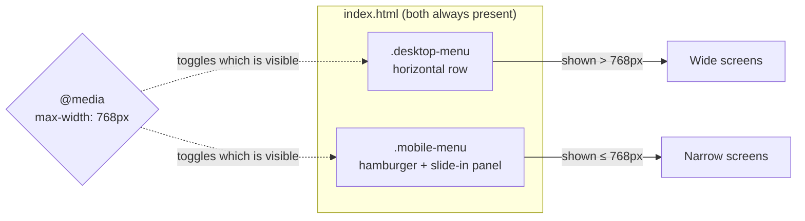

       

# Part 1 — Project Setup and the HTML Structure

Every good build starts with structure. Before we touch a single color or animation, we write the **HTML** — the *what*, not the *how it looks*. In this part we create the project, drop in the standard HTML boilerplate, connect our external resources (Font Awesome and the stylesheet), and lay down the markup for the navigation bar itself.

The one idea that shapes everything below: a responsive nav needs **two menus in the markup** — one for desktop, one for mobile — with identical links. It feels redundant at first, and we'll unpack exactly why it's done this way.

> 🔗 **Series:** [[Responsive Navigation - Tutorial Index]] · **Previous:** — · **Next:** [[Part 2 - CSS Foundations - Fonts, Tokens and Reset]]

---

## Table of Contents

- [What we're building (and what this part delivers)](#what-were-building-and-what-this-part-delivers)
- [Step 1 — Create the project](#step-1--create-the-project)
- [Step 2 — The HTML boilerplate](#step-2--the-html-boilerplate)
- [Step 3 — The header, nav, and logo](#step-3--the-header-nav-and-logo)
- [Step 4 — The desktop menu](#step-4--the-desktop-menu)
- [Step 5 — The mobile menu](#step-5--the-mobile-menu)
- [Step 6 — Link the JavaScript](#step-6--link-the-javascript)
- [The full file so far](#the-full-file-so-far)
- [Why two menus?](#why-two-menus)
- [Key Takeaways](#key-takeaways)
- [References](#references)

---

## What we're building (and what this part delivers)

By the end of the series we'll have a nav bar that shows a full link row on wide screens and a slide-in hamburger menu on narrow ones. By the end of **this part**, we'll have a complete, valid HTML document — it will look completely unstyled in the browser (a vertical list of blue links), and that is exactly correct. HTML defines meaning and structure; CSS handles appearance; JavaScript handles behavior. We do them in that order.

## Step 1 — Create the project

Make a folder and create three empty files plus an `images` folder inside it:

```
Responsive Navigation/
├── index.html
├── style.css
├── script.js
└── images/
    └── logo.svg
```

Drop your logo into `images/` as `logo.svg` (any SVG or PNG works — just match the filename in the markup later). If you don't have one yet, a placeholder is fine; we only reference it.

> [!TIP]
> The whole workflow is **edit → save → reload the browser**. No Node, no npm, no bundler. Open `index.html` directly, or serve the folder with a one-liner like `python3 -m http.server` and visit the printed address.

## Step 2 — The HTML boilerplate

Open `index.html` and lay down the standard skeleton every HTML5 document starts from:

```html
<!DOCTYPE html>
<html lang="en">
<head>
    <meta charset="UTF-8">
    <meta name="viewport" content="width=device-width, initial-scale=1.0">
    <script src="https://kit.fontawesome.com/ccce265c94.js"></script>
    <link rel="stylesheet" href="style.css">
    <title>GON - Responsive Navigation</title>
</head>
<body>

    <script src="script.js"></script>
</body>
</html>
```

Line by line:

- **`<!DOCTYPE html>`** tells the browser to use modern (standards) rendering. Always the first line.
- **`<html lang="en">`** — the `lang` attribute helps screen readers pick the right pronunciation and helps search engines. Set it to your content's language.
- **`<meta charset="UTF-8">`** lets the page use any character (accents, emoji, symbols) without corruption.
- **`<meta name="viewport" …>`** is *the* line that makes responsive design possible. It tells mobile browsers to render at the device's real width instead of pretending to be a ~980px desktop and shrinking everything down. Without it, our media query in Part 4 would do nothing on a real phone. (More on this in [[Part 2 - The Viewport Meta Tag and How Mobile Browsers Render Pages]].)
- **`<script src="https://kit.fontawesome.com/…">`** loads a **Font Awesome kit** — the icon library that gives us the hamburger bars and the social icons. It's a hosted CDN kit, so it needs an internet connection to render the icons.
- **`<link rel="stylesheet" href="style.css">`** connects our (currently empty) stylesheet.
- **`<title>`** is the text shown on the browser tab.

> [!NOTE]
> The Font Awesome kit URL (`ccce265c94`) is personal to a specific account. If the icons don't appear when you follow along, [create your own free kit](https://fontawesome.com/start) and swap in its script tag — or use the plain CSS CDN link instead.

## Step 3 — The header, nav, and logo

Inside `<body>` (above the `<script>` tag), add a semantic header with a navigation region and the logo:

```html
<header class="header">
    <nav class="nav-bar container">
        <a href="#"></a>

        <!-- menus go here -->

    </nav>
</header>
```

Why these tags:

- **`<header>`** is a semantic landmark for introductory content at the top of the page. Screen readers and search engines understand it as "the header," where a plain `<div>` would mean nothing.
- **`<nav>`** marks this as a **navigation** region — a set of major links. Assistive tech lets users jump straight to it. We give it two classes: `nav-bar` (its own styling) and `container` (a reusable "center me and cap my width" utility we'll define in Part 2).
- **The logo** is an `` wrapped in an `<a href="#">` so it links home (a real project would point `href` at `/` or `index.html`). The `./images/logo.svg` path is relative to `index.html`.

> [!TIP]
> The logo's `alt=""` is currently empty. An empty `alt` tells screen readers to *skip* the image — appropriate only for purely decorative graphics. Since this logo is also a link to home, a better value is descriptive text such as `alt="GON home"`. We'll revisit accessibility properly in [[Part 6 - Testing, Accessibility and Next Steps]].

## Step 4 — The desktop menu

Replace the `<!-- menus go here -->` comment with the desktop navigation — a `<ul>` of links plus two social icons:

```html
<!-- Desktop Navigation -->
<div class="desktop-menu">
    <ul class="desktop-menu-items">
        <li><a href="#">Home</a></li>
        <li><a href="#">Chapters</a></li>
        <li><a href="#">Summary</a></li>
        <li><a href="#">Takeaways</a></li>
        <li><a href="#">Author</a></li>
        <li><a href="#">Contact</a></li>
        <li><a href="#"><i class="menu-icon fa-brands fa-facebook"></i></a></li>
        <li><a href="#"><i class="menu-icon fa-brands fa-twitter"></i></a></li>
    </ul>
</div>
```

- A **`<ul>` of `<li>`s** is the correct, semantic way to mark up a menu: it *is* an unordered list of links. Screen readers announce "list, 8 items," which is genuinely useful.
- Each **`<a href="#">`** is a placeholder link. The `#` just points at the current page — swap in real URLs (or in-page anchors like `#contact`) in a real build.
- The **`<i>` elements** are Font Awesome icons. `fa-brands` is the brand-icon style; `fa-facebook` and `fa-twitter` pick the specific glyphs. The `menu-icon` class is ours, for styling in Part 3. Using `<i>` for icons is the Font Awesome convention (historically "italic," now repurposed).

## Step 5 — The mobile menu

Right after the desktop menu's closing `</div>`, add a **second** menu — the mobile one. It has the *same links*, plus a hamburger toggle button:

```html
<!-- Mobile Navigation -->
<div class="mobile-menu">
    <div class="mobile-menu-toggle">
        <i class="toggle-icon fa-solid fa-bars"></i>
    </div>
    <ul class="mobile-menu-items">
        <li><a href="#">Home</a></li>
        <li><a href="#">Chapters</a></li>
        <li><a href="#">Summary</a></li>
        <li><a href="#">Takeaways</a></li>
        <li><a href="#">Author</a></li>
        <li><a href="#">Contact</a></li>
        <li><a href="#"><i class="menu-icon fa-brands fa-facebook"></i></a></li>
        <li><a href="#"><i class="menu-icon fa-brands fa-twitter"></i></a></li>
    </ul>
</div>
```

- **`.mobile-menu-toggle`** is the tappable hamburger. Inside it, `fa-solid fa-bars` is the classic three-line "☰" icon. This is the element JavaScript will listen to in Part 5.
- **`.mobile-menu-items`** is the panel that slides in. Right now both menus are visible and stacked — ugly, but expected. CSS decides which one shows at which screen size (Part 3 and Part 4).

> [!IMPORTANT]
> Notice the link list is **identical** to the desktop menu's. Because these are two separate blocks of markup, **any change to your nav items must be made in both places** or the two menus will drift out of sync. This duplication is the main trade-off of the two-menu approach — see [Why two menus?](#why-two-menus) below.

## Step 6 — Link the JavaScript

The boilerplate already includes this at the very bottom of `<body>`:

```html
    <script src="script.js"></script>
</body>
```

**Placement matters.** By the time the browser reaches this line, it has already parsed the `<nav>` and its menus, so they exist in the DOM. When our `script.js` runs `document.querySelector('.mobile-menu-toggle')` in Part 5, it will actually find the element. If we'd put the script up in `<head>` without a `defer` attribute, it would run *before* the body was built and `querySelector` would return `null` — a classic beginner bug.

## The full file so far

Here's the complete `index.html` after this part:

```html
<!DOCTYPE html>
<html lang="en">
<head>
    <meta charset="UTF-8">
    <meta name="viewport" content="width=device-width, initial-scale=1.0">
    <script src="https://kit.fontawesome.com/ccce265c94.js"></script>
    <link rel="stylesheet" href="style.css">
    <title>GON - Responsive Navigation</title>
</head>
<body>
    <header class="header">
        <nav class="nav-bar container">
            <a href="#"></a>
            <!-- Desktop Navigation -->
            <div class="desktop-menu">
                <ul class="desktop-menu-items">
                    <li><a href="#">Home</a></li>
                    <li><a href="#">Chapters</a></li>
                    <li><a href="#">Summary</a></li>
                    <li><a href="#">Takeaways</a></li>
                    <li><a href="#">Author</a></li>
                    <li><a href="#">Contact</a></li>
                    <li><a href="#"><i class="menu-icon fa-brands fa-facebook"></i></a></li>
                    <li><a href="#"><i class="menu-icon fa-brands fa-twitter"></i></a></li>
                </ul>
            </div>

            <!-- Mobile Navigation -->
            <div class="mobile-menu">
                <div class="mobile-menu-toggle">
                    <i class="toggle-icon fa-solid fa-bars"></i>
                </div>
                <ul class="mobile-menu-items">
                    <li><a href="#">Home</a></li>
                    <li><a href="#">Chapters</a></li>
                    <li><a href="#">Summary</a></li>
                    <li><a href="#">Takeaways</a></li>
                    <li><a href="#">Author</a></li>
                    <li><a href="#">Contact</a></li>
                    <li><a href="#"><i class="menu-icon fa-brands fa-facebook"></i></a></li>
                    <li><a href="#"><i class="menu-icon fa-brands fa-twitter"></i></a></li>
                </ul>
            </div>
        </nav>
    </header>
    <script src="script.js"></script>
</body>
</html>
```

Save and open it in your browser. You'll see the logo (or a broken-image icon), then a long vertical list of links twice over, with a hamburger icon somewhere in the middle. **Completely unstyled — and completely correct.** Making sense of that mess is what CSS is for, starting in Part 2.

## Why two menus?

The obvious objection: *why write the links twice instead of styling one list two ways?* Fair question. Here's the reasoning, and the trade-offs.

**The approach used here** keeps two separate blocks — `.desktop-menu` and `.mobile-menu` — and uses a media query to show exactly one at a time (Part 4). The upside is *simplicity of styling*: the desktop list and the mobile slide-in panel are structurally different (a horizontal row vs. a vertical overlay with a toggle button), so giving each its own container means their CSS never fights. The hamburger toggle also naturally belongs only to the mobile block.

The downside is **duplication**: the link list exists twice, so edits must be mirrored, and the same content is sent to the browser twice (a tiny cost for a nav, but real).



**The alternative** — one `<ul>` restyled by media queries — removes the duplication but makes the CSS trickier (the single list must morph from a row into a full-screen overlay) and needs care to place the hamburger. Both are legitimate. We follow the two-menu version here because it's the clearest to learn from; [[Part 6 - Testing, Accessibility and Next Steps]] discusses refactoring to a single source of truth.

## Key Takeaways

- **Structure first.** HTML describes meaning; an unstyled page at this stage is a feature, not a bug.
- **Semantics matter.** `<header>`, `<nav>`, and a `<ul>` of links give the page meaning that `<div>`s can't — better for accessibility and SEO.
- **The viewport meta tag is mandatory** for responsive design; without it the Part 4 breakpoint won't work on real phones.
- **Two parallel menus** trade a little duplication for much simpler styling — keep their link lists in sync.
- **Script at the end of `<body>`** so the DOM exists before the JS queries it.

> ➡️ **Next up:** [[Part 2 - CSS Foundations - Fonts, Tokens and Reset]] — we bring in the Poppins font, define our color tokens and spacing/type scales, reset the browser defaults, and build the reusable `.container`.

---

## References

- MDN — [`<nav>`: The Navigation Section element](https://developer.mozilla.org/en-US/docs/Web/HTML/Element/nav "MDN reference for the semantic nav element")[^mdn-nav]
- MDN — [The viewport meta tag](https://developer.mozilla.org/en-US/docs/Web/HTML/Viewport_meta_tag "How the viewport meta tag controls mobile rendering")[^mdn-vp]
- Font Awesome — [Get started with a kit](https://fontawesome.com/start "Setting up a Font Awesome kit")[^fa]

> [!NOTE]
> This tutorial reconstructs the "GON – Responsive Navigation" project from its source files, cross-checked against MDN's HTML and accessibility references.

[^mdn-nav]: MDN Web Docs — semantics and correct usage of the `<nav>` landmark element.
[^mdn-vp]: MDN Web Docs — what the viewport meta tag does and why mobile layouts depend on it.
[^fa]: Font Awesome — official guide to creating and embedding an icon kit.
