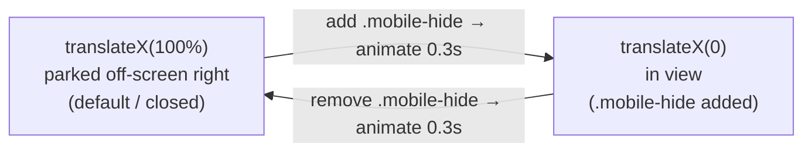

       

# Part 4 — The Mobile Menu and Responsive Behavior

This is the part that makes the whole thing "responsive." We'll do two things: add a **media query** that swaps the desktop menu for the mobile one at a chosen screen width, and build the **slide-in panel** that the hamburger reveals.

The key technique — and the most interesting idea in the whole project — is that we do **not** show and hide the mobile menu with `display`. Instead the panel is always present but parked **off-screen to the right**, and we slide it in and out with a CSS `transform`. This is what gives the smooth animation. Let's build it.

> 🔗 **Series:** [[Responsive Navigation - Tutorial Index]] · **Previous:** [[Part 3 - Styling the Desktop Navigation]] · **Next:** [[Part 5 - Adding JavaScript Interactivity]]

---

## Table of Contents

- [Step 1 — The media query: swap the menus](#step-1--the-media-query-swap-the-menus)
- [Step 2 — Style the hamburger toggle](#step-2--style-the-hamburger-toggle)
- [Step 3 — Build the slide-in panel](#step-3--build-the-slide-in-panel)
- [Step 4 — Park it off-screen with a transform](#step-4--park-it-off-screen-with-a-transform)
- [Step 5 — The `.mobile-hide` class (the switch)](#step-5--the-mobile-hide-class-the-switch)
- [Why slide, not toggle `display`?](#why-slide-not-toggle-display)
- [The full stylesheet so far](#the-full-stylesheet-so-far)
- [Gotchas worth knowing](#gotchas-worth-knowing)
- [Key Takeaways](#key-takeaways)
- [References](#references)

---

## Step 1 — The media query: swap the menus

In Part 3 we hid `.mobile-menu` and showed the desktop one. A **media query** lets us reverse that decision once the screen gets small. Add this at the bottom of `style.css`:

```css
@media (max-width: 768px) {
    .desktop-menu {
        display: none;
    }

    .mobile-menu {
        display: block;
    }
}
```

- **`@media (max-width: 768px)`** — the rules inside apply *only* when the viewport is **768px wide or narrower** (tablet-portrait and phones). Above 768px they're ignored, so the desktop layout from Part 3 stands.
- Inside, we **flip the visibility**: hide `.desktop-menu`, show `.mobile-menu` (as a `block`). One menu is always on screen; never both.

This is a **desktop-first** approach: we built the full desktop design, then added a media query to adapt *down* to small screens using `max-width`. (The opposite, mobile-first, starts small and uses `min-width` to add desktop rules. Both are valid — see [[Responsive Design]] and [[Part 7 - Media Queries Deep-Dive]].)

`768px` is a conventional tablet breakpoint, but it's not sacred — pick the width where *your* desktop layout starts to look cramped.

> [!TIP]
> Test breakpoints with your browser's **device toolbar** (F12 → the phone/tablet icon, or `Ctrl/Cmd+Shift+M`). Drag the viewport width across 768px and watch the menu swap. No physical phone required.

## Step 2 — Style the hamburger toggle

With the mobile menu now visible below 768px, style its hamburger icon:

```css
.toggle-icon {
    cursor: pointer;
    width: 24px;
    height: 24px;
    color: #fff;
}
```

- **`cursor: pointer`** signals it's clickable.
- **`color: #fff`** makes the three-bar icon white against the coral header.
- As noted for `.menu-icon` in Part 3, the `width`/`height` here have little visible effect on a Font Awesome glyph (its size follows `font-size`). They're harmless; keep them or swap to `font-size` if you want a bigger icon.

At this point, on a narrow screen you'll see the logo and a white hamburger — but tapping it does nothing yet. The panel exists; we just haven't positioned it. That's next.

## Step 3 — Build the slide-in panel

Now the star of the show — `.mobile-menu-items`, the dark panel that drops in from the top edge of the header and slides across. Add this rule (outside the media query — it's the panel's base styling; the media query only controls which *menu* is visible):

```css
/* Mobile Navigation */

.mobile-menu-items {
    background-color: rgba(0, 0, 0, 0.8);
    opacity: 0.9;
    position: absolute;
    top: 100%;
    left: 0;
    width: 100%;
    padding: 48px 32px;
    text-align: center;
    display: flex;
    flex-direction: column;
    gap: 32px;
    font-size: 24px;
    box-shadow: 0 2px 5px rgba(0, 0, 0, 0.1);
    border-top: 1px solid rgba(0, 0, 0, 0.1);
    transform: translateX(100%);
    transition: transform 0.3s ease-in;
}
```

That's a lot at once, so let's group it by job.

**Appearance:**
- `background-color: rgba(0, 0, 0, 0.8)` — a black panel at 80% opacity, so a hint of the page shows through.
- `opacity: 0.9` — makes the *whole* panel (text included) 90% opaque. Combined with the already-translucent background, this double-dims things slightly; more on that in [Gotchas](#gotchas-worth-knowing).
- `font-size: 24px` — bigger, tap-friendly text (type scale).
- `box-shadow` and `border-top` — subtle depth where the panel meets the header.

**Position (the important part):**
- `position: absolute` — takes the panel out of normal flow and positions it relative to its nearest *positioned* ancestor. That ancestor is `.nav-bar`, thanks to the `position: relative` we added back in Part 3. **This is why that line mattered.**
- `top: 100%` — place the panel's top edge at the *bottom* of the nav bar (100% of the nav bar's height down), so it hangs just below the header.
- `left: 0` and `width: 100%` — stretch it across the full width of the nav bar.

**Layout of the links inside:**
- `display: flex; flex-direction: column` — stack the links **vertically** (a column, not a row like desktop).
- `gap: 32px` — even vertical spacing.
- `text-align: center` and `padding: 48px 32px` — center the links and give the panel breathing room.

If you reload now, you *won't* see the panel — because of the last two lines, which we'll unpack next.

## Step 4 — Park it off-screen with a transform

These two lines are the trick:

```css
    transform: translateX(100%);
    transition: transform 0.3s ease-in;
```

- **`transform: translateX(100%)`** moves the panel horizontally to the right by **100% of its own width**. Since the panel is `width: 100%` (as wide as the header), translating it a full width to the right pushes it **completely off the right edge of the screen**. It's fully rendered and laid out — just parked out of sight.
- **`transition: transform 0.3s ease-in`** says: *whenever the `transform` value changes, animate the change over 0.3 seconds* with an ease-in speed curve. On its own this line does nothing visible — it's a standing instruction that pays off the instant `transform` changes (which happens next).



So the *closed* state is the default: panel off-screen right. To *open* it, we just need to set `transform: translateX(0)` — which brings it back to its natural position (flush under the header). Because of the `transition`, it glides in over 0.3s rather than snapping. That "set translateX to 0" is exactly what the next rule does.

## Step 5 — The `.mobile-hide` class (the switch)

Add one final rule:

```css
.mobile-menu-items.mobile-hide {
    transform: translateX(0);
}
```

- **`.mobile-menu-items.mobile-hide`** (no space between the two class names) targets an element that has **both** classes at once. So this rule only applies when we add `mobile-hide` to the panel.
- It overrides the default `translateX(100%)` with `translateX(0)` — sliding the panel into view.

> [!WARNING]
> The class name **`.mobile-hide` is misleading**: despite "hide," adding it *shows* the menu (it sets `translateX(0)`, the visible position). The default state — *without* the class — is the hidden one. It's a quirk of this codebase; a clearer name would be `.is-open` or `.mobile-show`. We'll keep the original name so it matches the code, but now you know why it reads backwards. This exact class is what JavaScript toggles in [[Part 5 - Adding JavaScript Interactivity]].

Reload on a narrow screen. The panel is still hidden (we haven't wired up the tap yet), but you can **prove it works** using DevTools: inspect the `<ul class="mobile-menu-items">`, and in the Elements panel add the class `mobile-hide` to it by hand. The dark panel slides in from the right. Remove the class — it slides back out. That's the entire visual mechanism; Part 5 just automates adding/removing that class on tap.

## Why slide, not toggle `display`?

You *could* hide the menu with `display: none` and show it with `display: block`. It's simpler — so why the transform dance?

**Because `display` can't be animated.** `display` is a discrete property: it flips instantly from `none` to `block` with no in-between, so there's nothing for a `transition` to interpolate. The menu would *pop* in and out — functional, but abrupt.

`transform`, by contrast, is smoothly animatable, and it's also **cheap for the browser to animate**: transforms (and `opacity`) are handled by the compositor and don't trigger expensive layout recalculation, so the slide stays at 60fps even on phones. Animating `left` or `width` instead *would* cause layout work on every frame and can stutter.

| Approach | Animates smoothly? | Performance | Element in DOM when closed? |
|:---|:---:|:---|:---:|
| `display: none/block` | ❌ instant pop | fine (but no animation) | removed from render |
| `transform: translateX()` | ✅ 0.3s glide | excellent (compositor) | yes, just off-screen |
| animating `left`/`width` | ✅ but janky | poor (layout per frame) | yes |

So the transform approach buys us a smooth, performant slide for the cost of one extra `transform` line and keeping the element in the layout. That's the trade this project makes.

## The full stylesheet so far

The mobile-specific additions (append to Parts 2–3):

```css
/* Mobile Navigation */

.mobile-menu-items {
    background-color: rgba(0, 0, 0, 0.8);
    opacity: 0.9;
    position: absolute;
    top: 100%;
    left: 0;
    width: 100%;
    padding: 48px 32px;
    text-align: center;
    display: flex;
    flex-direction: column;
    gap: 32px;
    font-size: 24px;
    box-shadow: 0 2px 5px rgba(0, 0, 0, 0.1);
    border-top: 1px solid rgba(0, 0, 0, 0.1);
    transform: translateX(100%);
    transition: transform 0.3s ease-in;
}

.toggle-icon {
    cursor: pointer;
    width: 24px;
    height: 24px;
    color: #fff;
}

.mobile-menu-items.mobile-hide {
    transform: translateX(0);
}

@media (max-width: 768px) {
    .desktop-menu {
        display: none;
    }

    .mobile-menu {
        display: block;
    }
}
```

## Gotchas worth knowing

A few honest rough edges in this implementation — good to understand, easy to improve later:

- **Horizontal scrollbar when closed.** The panel is `width: 100%` and pushed `translateX(100%)` to the right, so its right edge sits at *200%* — off-screen, but still part of the page's scrollable area. Some browsers show a horizontal scrollbar as a result. The fix is one line: `body { overflow-x: hidden; }`. We'll add it in [[Part 6 - Testing, Accessibility and Next Steps]].
- **Double transparency.** `background-color: rgba(0,0,0,0.8)` *and* `opacity: 0.9` both reduce opacity, compounding each other. If you want a crisper panel, drop the `opacity` line and control translucency through the `rgba` alpha alone.
- **Ease-in feels slightly abrupt on the way out.** `ease-in` starts slow and ends fast. For a menu, `ease-out` (fast then settling) or `ease-in-out` often feels nicer. Try swapping it and see which you prefer.

None of these break the component — they're the difference between "works" and "polished."

## Key Takeaways

- **A media query swaps the menus** at `max-width: 768px` — desktop-first, adapting *down*.
- **The panel is positioned `absolute` against `.nav-bar`**, which works only because the nav bar is `position: relative` (Part 3).
- **`transform: translateX(100%)` parks the panel off-screen**; `translateX(0)` brings it back — and `transition` animates between them.
- **`display` can't be animated; `transform` can** — and transforms are compositor-cheap, so the slide stays smooth.
- **`.mobile-hide` shows the menu** despite its name — the no-class default is the hidden state.

> ➡️ **Next up:** [[Part 5 - Adding JavaScript Interactivity]] — five lines of vanilla JS that toggle `.mobile-hide` when the hamburger is tapped, turning this static mechanism into a working menu.

---

## References

- MDN — [Using media queries](https://developer.mozilla.org/en-US/docs/Web/CSS/CSS_media_queries/Using_media_queries "Syntax and features of media queries")[^mdn-mq]
- MDN — [`transform: translateX()`](https://developer.mozilla.org/en-US/docs/Web/CSS/transform-function/translateX "The translateX transform function")[^mdn-tx]
- MDN — [Using CSS transitions](https://developer.mozilla.org/en-US/docs/Web/CSS/CSS_transitions/Using_CSS_transitions "How transitions animate property changes")[^mdn-tr]
- web.dev — [Animations and performance](https://web.dev/articles/animations-guide "Why transform and opacity animate cheaply")[^webdev]

> [!NOTE]
> Built from the project's `style.css`. The media-query and breakpoint discussion complements this vault's [[Responsive Design]] and [[Part 7 - Media Queries Deep-Dive]] notes.

[^mdn-mq]: MDN Web Docs — media query syntax, `max-width`, and feature queries.
[^mdn-tx]: MDN Web Docs — the `translateX()` transform function and percentage units.
[^mdn-tr]: MDN Web Docs — animating property changes with `transition`.
[^webdev]: web.dev — which CSS properties are cheap to animate and why.
