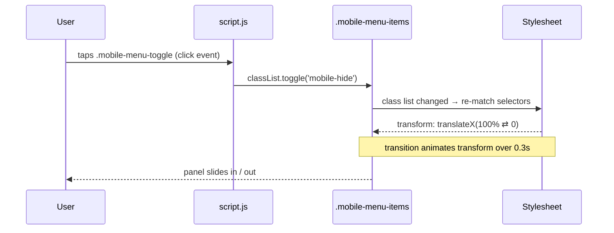

       

# Part 5 — Adding JavaScript Interactivity

Everything visual is already done. In [[Part 4 - The Mobile Menu and Responsive Behavior]] we built a panel that slides in whenever it has the `.mobile-hide` class and slides out when it doesn't — and we proved it by adding the class by hand in DevTools. All that's missing is a way to add and remove that class **when the user taps the hamburger**. That's the one job for JavaScript, and it takes five lines.

This is the ideal shape for front-end JS: **CSS owns the animation and appearance; JavaScript owns nothing but the state flip.** Keeping that boundary clean is what makes the code so short.

> 🔗 **Series:** [[Responsive Navigation - Tutorial Index]] · **Previous:** [[Part 4 - The Mobile Menu and Responsive Behavior]] · **Next:** [[Part 6 - Testing, Accessibility and Next Steps]]

---

## Table of Contents

- [The whole script](#the-whole-script)
- [Step 1 — Select the elements](#step-1--select-the-elements)
- [Step 2 — Listen for a click](#step-2--listen-for-a-click)
- [Step 3 — Toggle the class](#step-3--toggle-the-class)
- [How the pieces connect](#how-the-pieces-connect)
- [Why this works without `DOMContentLoaded`](#why-this-works-without-domcontentloaded)
- [Test it](#test-it)
- [Key Takeaways](#key-takeaways)
- [References](#references)

---

## The whole script

Here's the entire `script.js` — all of it:

```javascript
const mobileMenuToggle = document.querySelector('.mobile-menu-toggle')
const mobileMenuItems = document.querySelector('.mobile-menu-items')

mobileMenuToggle.addEventListener('click', () => {
    mobileMenuItems.classList.toggle('mobile-hide')
})
```

Five lines. Let's take them one concept at a time — each idea here (selecting, listening, toggling) is a fundamental you'll reuse in every interactive component you ever build.

## Step 1 — Select the elements

```javascript
const mobileMenuToggle = document.querySelector('.mobile-menu-toggle')
const mobileMenuItems = document.querySelector('.mobile-menu-items')
```

- **`document.querySelector(selector)`** searches the page for the **first** element matching a CSS selector and hands it back as a DOM object we can manipulate. We pass the same class selectors we wrote in the CSS.
- **`mobileMenuToggle`** is the hamburger `<div class="mobile-menu-toggle">` — the thing we'll listen to.
- **`mobileMenuItems`** is the `<ul class="mobile-menu-items">` — the panel whose class we'll flip.
- **`const`** declares a variable that won't be reassigned. We're grabbing these elements once and keeping a reference; the references never change (the element's *contents* can, but our variables keep pointing at the same nodes), so `const` is exactly right.

Think of this step as *"get a handle on the two elements I care about."* Nothing happens yet — we've just looked them up.

## Step 2 — Listen for a click

```javascript
mobileMenuToggle.addEventListener('click', () => {
    // ...runs on every click
})
```

- **`.addEventListener('click', callback)`** tells the browser: *"whenever this element is clicked (or tapped on a touchscreen), run this function."* It's the standard way to react to user actions — `'click'` is one of dozens of event types (`'scroll'`, `'keydown'`, `'submit'`, …).
- The **`() => { ... }`** is an **arrow function** — a compact function definition. It's the *callback*: code that isn't run now but is handed to the browser to run *later*, each time the event fires. Every tap on the hamburger re-runs its body.

## Step 3 — Toggle the class

Inside the callback, the single line that does the work:

```javascript
mobileMenuItems.classList.toggle('mobile-hide')
```

- **`.classList`** is an element's live list of CSS classes, with handy methods: `.add()`, `.remove()`, `.contains()`, and `.toggle()`.
- **`.toggle('mobile-hide')`** flips the class: if the panel doesn't have `mobile-hide`, it's added; if it already has it, it's removed. One method call handles *both* open and close — no `if/else` needed.

And that closes the loop with Part 4:

- Class **absent** → CSS default `transform: translateX(100%)` → panel parked off-screen (**closed**).
- Class **present** → CSS rule `.mobile-menu-items.mobile-hide { transform: translateX(0) }` → panel slides in (**open**).

Because the CSS `transition` is watching `transform`, each toggle produces the smooth 0.3s glide automatically. JavaScript never touches styles, positions, or animation — it just adds or removes one word.

## How the pieces connect

The full round-trip, from tap to slide:



This separation is the takeaway worth internalizing: **behavior (JS) toggles state; presentation (CSS) reacts to state.** It scales far beyond this menu — the same "toggle a class, let CSS respond" pattern powers accordions, modals, dark-mode switches, and tabs.

## Why this works without `DOMContentLoaded`

A fair question: the script runs `document.querySelector('.mobile-menu-toggle')` immediately — how do we know the element exists yet? If it didn't, `querySelector` would return `null`, and calling `.addEventListener` on `null` would throw `Cannot read properties of null`.

It works because of **where the `<script>` tag sits** — at the very bottom of `<body>`, which we set up in [[Part 1 - Project Setup and HTML Structure]]:

```html
        </nav>
    </header>
    <script src="script.js"></script>   <!-- runs last, after the nav exists -->
</body>
```

The browser parses HTML top to bottom. By the time it reaches this line, the entire `<header>` and its menus are already built into the DOM, so the selectors find their targets.

> [!TIP]
> Two equivalent ways to guarantee the DOM is ready if you'd rather put the script in `<head>`:
> - Add the **`defer`** attribute: `<script src="script.js" defer></script>` — the script downloads in parallel and runs only after the HTML is fully parsed.
> - Wrap the code in `document.addEventListener('DOMContentLoaded', () => { … })`.
>
> For this project, "script at the end of `<body>`" already does the job, so neither is strictly required.

## Test it

Save `script.js` and reload the page in a **narrow** window (or DevTools device mode):

1. You see the logo and the white hamburger on the coral bar.
2. **Tap the hamburger** → the dark panel slides in from the right, links stacked and centered.
3. **Tap it again** → the panel slides back out.
4. Resize the window **wider than 768px** → the mobile menu disappears and the full desktop link row returns (the media query from Part 4 at work).

If tapping does nothing, open the **Console** (F12). The usual culprits:

- A **typo in a selector** (`.mobile-menu-toggle` must match the HTML class exactly) → `querySelector` returns `null` → `Cannot read properties of null (reading 'addEventListener')`.
- The **`<script>` tag in the wrong place** (in `<head>` without `defer`) → same `null` error.
- **`script.js` not linked** or the filename mismatched → no errors, just no behavior.

## Key Takeaways

- **`document.querySelector`** grabs an element by CSS selector so JS can work with it.
- **`addEventListener('click', …)`** runs a callback every time the element is clicked or tapped.
- **`classList.toggle('mobile-hide')`** adds the class if absent and removes it if present — open and close in one call.
- **JS flips state; CSS animates.** JavaScript never sets styles here — it toggles one class and lets the Part 4 CSS do the rest.
- **Script placement** (end of `<body>`, or `defer`) is what guarantees the elements exist when the script runs.

> ➡️ **Next up:** [[Part 6 - Testing, Accessibility and Next Steps]] — a full testing checklist, the accessibility upgrades this minimal version is missing (keyboard, ARIA, focus, reduced motion), and ideas for taking the component further, plus deploying it.

---

## References

- MDN — [`Document.querySelector()`](https://developer.mozilla.org/en-US/docs/Web/API/Document/querySelector "Selecting elements by CSS selector")[^mdn-qs]
- MDN — [`EventTarget.addEventListener()`](https://developer.mozilla.org/en-US/docs/Web/API/EventTarget/addEventListener "Reacting to events")[^mdn-ael]
- MDN — [`Element.classList` & `toggle()`](https://developer.mozilla.org/en-US/docs/Web/API/Element/classList "Reading and mutating an element's class list")[^mdn-cl]

> [!NOTE]
> Built from the project's `script.js`. The event-driven, class-toggling pattern is the same one used in the sibling [[TUTORIAL - How to build a sticky navigation bar]].

[^mdn-qs]: MDN Web Docs — `querySelector` and CSS-selector-based element lookup.
[^mdn-ael]: MDN Web Docs — attaching event handlers with `addEventListener`.
[^mdn-cl]: MDN Web Docs — the `classList` API, including `add`, `remove`, and `toggle`.
