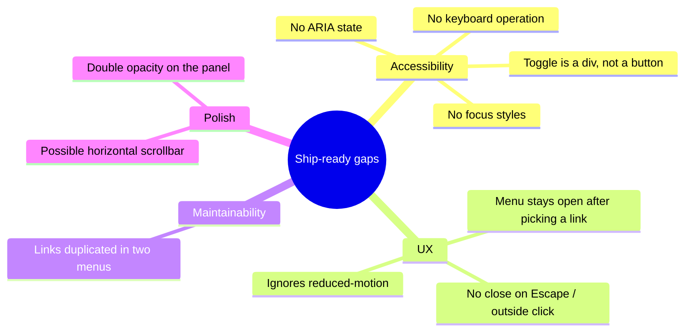

         

# Part 6 — Testing, Accessibility and Next Steps

The component **works**: a full menu on desktop, a sliding hamburger menu on mobile. But "works when I click it" and "ready to ship" are different bars. In this final part we test it properly, then look honestly at what the minimal version is *missing* — mostly around **accessibility** — and how to close those gaps. We'll finish with refactor ideas and how to deploy.

Think of this as the difference between a working exercise and a component you'd be comfortable putting on a real site.

> 🔗 **Series:** [[Responsive Navigation - Tutorial Index]] · **Previous:** [[Part 5 - Adding JavaScript Interactivity]] · **Next:** — (series complete)

---

## Table of Contents

- [The complete project](#the-complete-project)
- [Testing checklist](#testing-checklist)
- [Where this minimal version falls short](#where-this-minimal-version-falls-short)
- [Accessibility upgrades](#accessibility-upgrades)
- [Polish fixes](#polish-fixes)
- [Refactor ideas](#refactor-ideas)
- [Deploying](#deploying)
- [Series recap](#series-recap)
- [Key Takeaways](#key-takeaways)
- [References](#references)

---

## The complete project

For reference, here are all three files as they stand after Parts 1–5.

**`script.js`** — the entire behavior:

```javascript
const mobileMenuToggle = document.querySelector('.mobile-menu-toggle')
const mobileMenuItems = document.querySelector('.mobile-menu-items')

mobileMenuToggle.addEventListener('click', () => {
    mobileMenuItems.classList.toggle('mobile-hide')
})
```

The full `index.html` is in [[Part 1 - Project Setup and HTML Structure]] and the full `style.css` is assembled across [[Part 2 - CSS Foundations - Fonts, Tokens and Reset]], [[Part 3 - Styling the Desktop Navigation]], and [[Part 4 - The Mobile Menu and Responsive Behavior]].

## Testing checklist

Load the page and walk through these. Use your browser's **device toolbar** (`Ctrl/Cmd+Shift+M`) to switch between wide and narrow widths.

**Desktop (> 768px):**

- [ ] Logo sits at the far left; the link row and social icons at the far right.
- [ ] Everything is vertically centered on the coral bar.
- [ ] Hovering a link or icon turns it amber.
- [ ] No hamburger icon is visible.

**Mobile (≤ 768px):**

- [ ] The link row is gone; only the logo and a white hamburger show.
- [ ] Tapping the hamburger slides the dark panel in from the right.
- [ ] Links are stacked, centered, and comfortably tappable.
- [ ] Tapping the hamburger again slides the panel back out.

**The seam:**

- [ ] Slowly drag the width across 768px — the menus swap cleanly with no overlap or flash.
- [ ] No horizontal scrollbar appears at any width (see the [overflow fix](#polish-fixes) if one does).
- [ ] The Console (F12) shows no errors.

> [!TIP]
> Run a **Lighthouse** audit (DevTools → Lighthouse) against the page. It'll flag several of the accessibility issues discussed next, and gives you a concrete score to improve.

## Where this minimal version falls short

The build is intentionally minimal for learning. Before shipping, know its real gaps:



The good news: each is a small, self-contained fix.

## Accessibility upgrades

This is the most important section. The current toggle is invisible to keyboard and screen-reader users. Here's how to fix that.

### 1. Make the toggle a real `<button>`

The hamburger is a `<div>`, which is not focusable and not announced as interactive. Swap it for a `<button>` (in `index.html`):

```html
<button class="mobile-menu-toggle" aria-label="Open menu" aria-expanded="false" aria-controls="mobile-menu-items">
    <i class="toggle-icon fa-solid fa-bars"></i>
</button>
```

- **`<button>`** is focusable and clickable by keyboard (Enter/Space) for free — no extra JS.
- **`aria-label="Open menu"`** gives screen readers a name (the icon alone announces nothing).
- **`aria-expanded`** tells assistive tech whether the menu is open — we'll keep it in sync with JS.
- **`aria-controls`** links the button to the panel it controls (give the `<ul>` `id="mobile-menu-items"`).

Reset the button's native styling in CSS so it still looks like the icon:

```css
.mobile-menu-toggle {
    background: none;
    border: none;
    cursor: pointer;
}
```

### 2. Keep `aria-expanded` in sync

Update `script.js` so the ARIA state reflects reality:

```javascript
const mobileMenuToggle = document.querySelector('.mobile-menu-toggle')
const mobileMenuItems = document.querySelector('.mobile-menu-items')

mobileMenuToggle.addEventListener('click', () => {
    const isOpen = mobileMenuItems.classList.toggle('mobile-hide')
    mobileMenuToggle.setAttribute('aria-expanded', String(isOpen))
    mobileMenuToggle.setAttribute('aria-label', isOpen ? 'Close menu' : 'Open menu')
})
```

- **`classList.toggle` returns a boolean** — `true` if the class is now present (open), `false` if not. We capture it in `isOpen` and mirror it into `aria-expanded`.

### 3. Add visible focus styles

Keyboard users need to see where they are. Never remove focus outlines without replacing them:

```css
.nav-bar a:focus-visible,
.mobile-menu-toggle:focus-visible {
    outline: 2px solid var(--secondary-color);
    outline-offset: 2px;
}
```

- **`:focus-visible`** shows the outline for keyboard focus but not for mouse clicks — the best of both worlds.

### 4. Close the menu after choosing a link

Right now, tapping a link navigates but leaves the panel open. Close it:

```javascript
mobileMenuItems.querySelectorAll('a').forEach((link) => {
    link.addEventListener('click', () => {
        mobileMenuItems.classList.remove('mobile-hide')
        mobileMenuToggle.setAttribute('aria-expanded', 'false')
        mobileMenuToggle.setAttribute('aria-label', 'Open menu')
    })
})
```

> [!NOTE]
> Remember the `.mobile-hide` naming quirk from [[Part 4 - The Mobile Menu and Responsive Behavior]]: removing the class *closes* the menu (back to the off-screen default). It reads backwards, but it's correct.

### 5. Respect reduced motion

Some users get motion sick from sliding animations. Honor their system setting:

```css
@media (prefers-reduced-motion: reduce) {
    .mobile-menu-items {
        transition: none;
    }
}
```

## Polish fixes

Two quick wins mentioned earlier in the series:

**Kill the phantom horizontal scrollbar** (the off-screen panel can extend the scrollable area):

```css
body {
    overflow-x: hidden;
}
```

**Simplify the panel's transparency** — drop the redundant `opacity` and control translucency through the background alpha alone:

```css
.mobile-menu-items {
    background-color: rgba(0, 0, 0, 0.9);
    /* remove: opacity: 0.9; */
}
```

**Softer easing** — `ease-out` (or `ease-in-out`) usually feels better than `ease-in` for a menu:

```css
.mobile-menu-items {
    transition: transform 0.3s ease-out;
}
```

## Refactor ideas

Directions to grow the component once the essentials are solid:

- **One source of truth for the links.** The biggest structural smell is the duplicated link list (flagged in [[Part 1 - Project Setup and HTML Structure]]). Options: render both menus from a single JS array, use a templating/`<template>` approach, or restyle a *single* `<ul>` with media queries so there's only one list to maintain.
- **CSS-only version.** The whole toggle can be done with zero JavaScript using the "checkbox hack" (`<input type="checkbox">` + `:checked` sibling selectors) or a `<details>`/`<summary>` element. Great for a no-JS challenge; JS is still the more flexible, accessible route for anything beyond a simple toggle.
- **Animate the hamburger into an ✕.** Swap `fa-bars` for a close icon on open, or animate three `<span>` bars into an X for a premium feel.
- **Trap focus while open.** For a full-screen overlay menu, keep keyboard focus inside the panel until it closes, and close on `Escape`.
- **Trim the font import.** Part 2 loads every Poppins weight; request only `400` and `500` to shrink the download.

## Deploying

This is three static files — deployment is trivial and free.

1. **GitHub** — the project already has a remote:
   ```bash
   git add -A
   git commit -m "Finish responsive navigation bar"
   git push origin main
   ```
   Repo: [github.com/gmansoain/web-responsive-navigation](https://github.com/gmansoain/web-responsive-navigation)
2. **Netlify** — connect the repo (or drag-and-drop the folder onto the Netlify dashboard). No build command, no publish directory beyond the project root. You'll get a live URL in seconds — the same flow used for the sibling projects in [[Web Projects - Index]].
3. **GitHub Pages** — alternatively, enable Pages on the repo for a free `github.io` URL.

> [!IMPORTANT]
> Because icons and the font come from CDNs, the deployed page needs an internet connection to render them. That's fine for a public site; just don't expect the icons offline.

## Series recap

Six parts, from empty folder to deployable component:

| Part | What it added |
|:---:|:---|
| [[Part 1 - Project Setup and HTML Structure]] | Semantic HTML for two parallel menus |
| [[Part 2 - CSS Foundations - Fonts, Tokens and Reset]] | Poppins, tokens, reset, `.container` |
| [[Part 3 - Styling the Desktop Navigation]] | Flexbox layout and hover states |
| [[Part 4 - The Mobile Menu and Responsive Behavior]] | Media query + slide-in transform |
| [[Part 5 - Adding JavaScript Interactivity]] | `classList.toggle` on tap |
| **Part 6** | Testing, accessibility, polish, deploy |

The single most transferable idea: **HTML structures, CSS presents and animates, JavaScript flips state.** Keep those three responsibilities separate and even complex UI stays this understandable.

## Key Takeaways

- **Test the seam, not just the states** — the 768px crossover is where responsive bugs hide.
- **A `<div>` toggle is an accessibility bug.** Use a `<button>`, add `aria-expanded`/`aria-label`, and show `:focus-visible` outlines.
- **Close the menu on link click**, respect **`prefers-reduced-motion`**, and consider Escape/outside-click.
- **Small polish fixes** (`overflow-x: hidden`, single opacity, `ease-out`) separate "works" from "polished."
- **The duplicated link list** is the main thing to refactor toward a single source of truth.
- **Deploying static files** to GitHub + Netlify takes minutes.

> 🎉 **Series complete.** You built a responsive navigation bar from an empty folder — and you know not just *how* it works but *why* each decision was made. Back to the hub: [[Responsive Navigation - Tutorial Index]].

---

## References

- MDN — [ARIA: `button` role & disclosure patterns](https://developer.mozilla.org/en-US/docs/Web/Accessibility/ARIA/Roles/button_role "Accessible buttons and toggles")[^mdn-aria]
- MDN — [`prefers-reduced-motion`](https://developer.mozilla.org/en-US/docs/Web/CSS/@media/prefers-reduced-motion "Respecting users' motion preferences")[^mdn-prm]
- MDN — [`:focus-visible`](https://developer.mozilla.org/en-US/docs/Web/CSS/:focus-visible "Showing focus rings only when useful")[^mdn-fv]
- WAI-ARIA Authoring Practices — [Disclosure (show/hide) pattern](https://www.w3.org/WAI/ARIA/apg/patterns/disclosure/ "The accessible pattern behind a menu toggle")[^apg]

> [!NOTE]
> Accessibility guidance follows the WAI-ARIA Authoring Practices and MDN. This closes the "GON – Responsive Navigation" tutorial series.

[^mdn-aria]: MDN Web Docs — accessible button semantics and toggle patterns.
[^mdn-prm]: MDN Web Docs — the `prefers-reduced-motion` media feature.
[^mdn-fv]: MDN Web Docs — `:focus-visible` for keyboard-only focus rings.
[^apg]: W3C WAI-ARIA Authoring Practices — the disclosure pattern for show/hide toggles.
