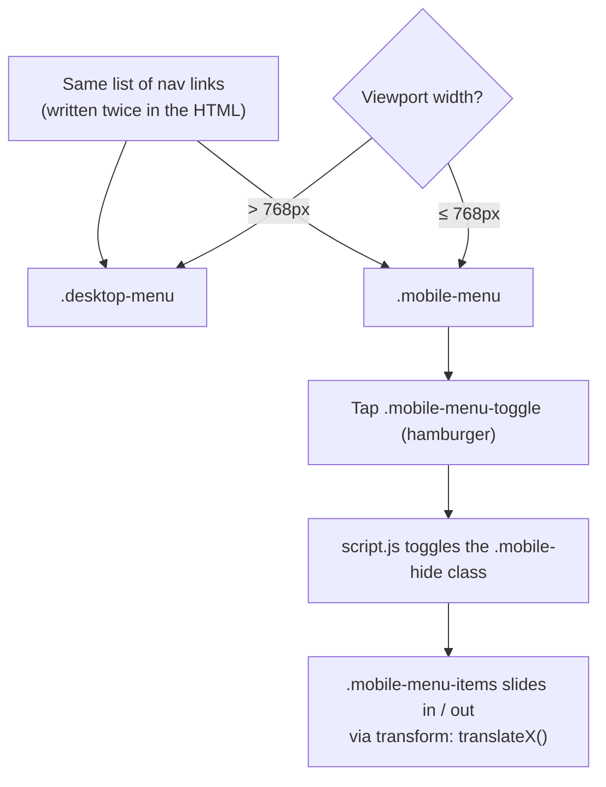

       

# Building a Responsive Navigation Bar, From Scratch

Almost every website opens with the same component: a bar across the top holding a logo on one side and a set of links on the other. It looks trivial — until the screen gets narrow. Eight links that sit comfortably on a laptop collide into an unreadable pile on a phone. The professional answer is a **responsive navigation bar**: a full horizontal menu on wide screens that collapses into a tap-to-open **hamburger menu** on small ones.

This series builds that component end to end, from an empty folder to a finished, deployable widget — using nothing but **HTML, CSS, and a handful of vanilla JavaScript**. No frameworks, no build step, no dependencies to install. If you can open a file in a browser, you can follow along.

> 🔗 **Series:** Building a Responsive Navigation Bar · **Repo:** [web-responsive-navigation](https://github.com/gmansoain/web-responsive-navigation)

---

## What we're building

A single-file demo page — "GON – Responsive Navigation" — with one header containing:

- A **logo** on the left.
- On wide screens (**> 768px**): a horizontal row of links — *Home, Chapters, Summary, Takeaways, Author, Contact* — plus two social icons.
- On narrow screens (**≤ 768px**): a **hamburger icon**. Tapping it slides a dark, full-width menu panel in from the right; tapping again slides it back out.

The clever part is the technique: instead of *showing and hiding* the mobile menu, we keep it permanently in the DOM but parked **off-screen to the right**, then slide it into view with a CSS `transform`. JavaScript's only job is to flip one class.



## The finished file structure

Three source files and one image — that's the entire project:

```
Responsive Navigation/
├── index.html        ← structure (the two menus live here)
├── style.css         ← all styling + the responsive breakpoint
├── script.js         ← 5 lines that toggle the mobile menu
└── images/
    └── logo.svg       ← the brand mark
```

External resources load from CDNs at runtime, so an internet connection is needed for them to render:

- **Font Awesome** (icon kit) — the hamburger, Facebook, and Twitter icons.
- **Google Fonts** — the *Poppins* typeface.

## The series roadmap

Read the parts in order the first time — each one builds directly on the file left behind by the previous one. Come back to any single part later as a reference.

| Part | What you'll build | Focus |
|:---:|:---|:---|
| **1** | [[Part 1 - Project Setup and HTML Structure]] | Folder, files, and the semantic HTML for both menus |
| **2** | [[Part 2 - CSS Foundations - Fonts, Tokens and Reset]] | Poppins, design tokens, the reset, the `.container` |
| **3** | [[Part 3 - Styling the Desktop Navigation]] | Flexbox layout, links, hover states |
| **4** | [[Part 4 - The Mobile Menu and Responsive Behavior]] | The `@media` breakpoint and the slide-in transform |
| **5** | [[Part 5 - Adding JavaScript Interactivity]] | Toggling the menu with `classList.toggle` |
| **6** | [[Part 6 - Testing, Accessibility and Next Steps]] | Testing, a11y fixes, refactors, and deploying |

## Prerequisites

You don't need much:

- A **text editor** (VS Code is a fine default) and any **modern browser**.
- Comfort with the very basics of **HTML tags** and **CSS selectors**. If those are new, skim [[04_Introduction to CSS and Selectors]] and [[02_HTML Elements and Tags]] first.
- Helpful but not required: a feel for **Flexbox** ([[07_Layout with Flexbox]]) and **media queries** ([[Responsive Design]]). We'll explain the parts we use as we reach them.

> [!TIP]
> There is **no build tooling** here. Your entire workflow is: edit a file → save → reload the browser. If you'd like automatic reloads, VS Code's *Live Server* extension is a common (optional) choice.

## How to use this series

Each part follows the same rhythm: a short *why*, the exact code to add, then a line-by-line *what just happened*. Type the code out rather than pasting it — the muscle memory is half the point — and reload the browser at the end of every part to watch the component take shape.

> ➡️ **Start here:** [[Part 1 - Project Setup and HTML Structure]] — we create the folder, the three files, and the HTML that both menus are built from.

---

## Related notes

- [[TUTORIAL - How to build a sticky navigation bar]] — a sibling project; a nav that transforms on scroll.
- [[Tutorial - How to create a smooth scroll navigation]] — smooth-scrolling nav links.
- [[07_Layout with Flexbox]] — the layout engine behind the whole bar.
- [[Responsive Design]] — media queries, breakpoints, and the mobile-first vs desktop-first choice.
